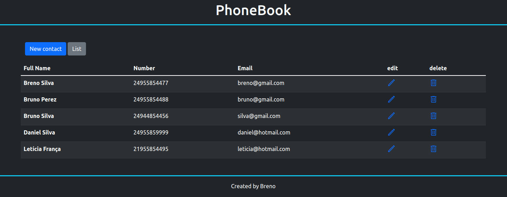
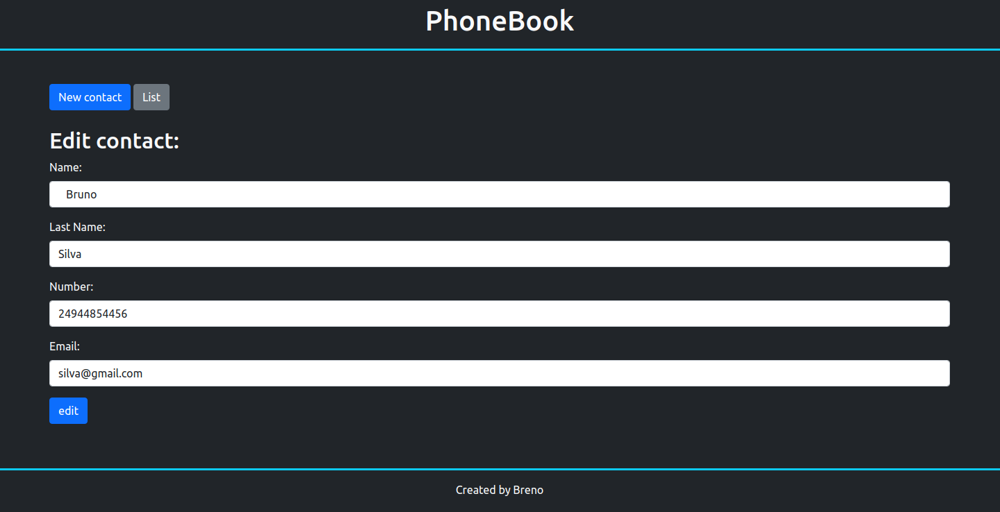
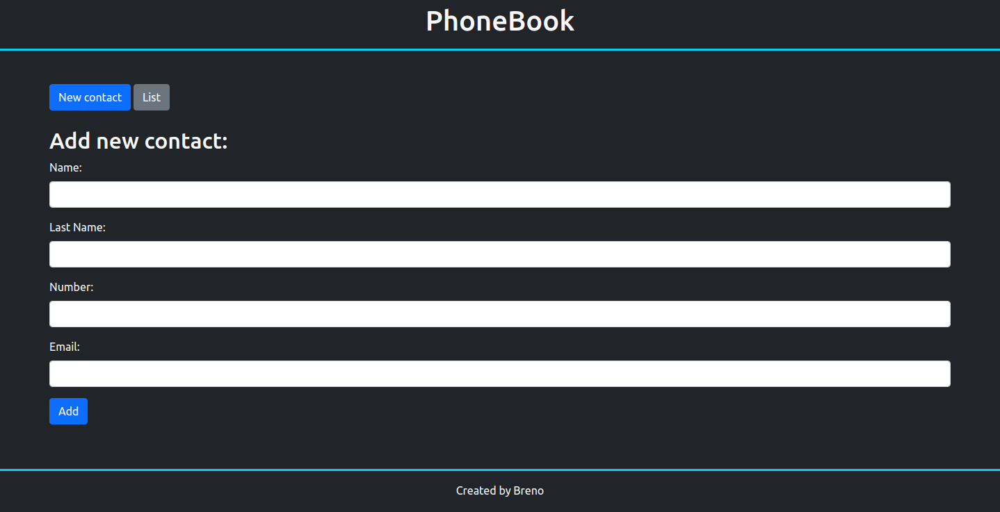

# PhoneBook 📗​

## 👀 Como ficou ???

</img>
----------
</img>
----------
</img>
----------

## 🧑‍💻 Tecnologias usadas

O projeto foi desenvolvido com as seguintes tecnologias:
- [TypeScript](https://www.typescriptlang.org/)
- [Nodejs](https://nodejs.org/en/docs/)
- [Express](https://expressjs.com/pt-br/)
- [Mustache](https://github.com/janl/mustache.js/)
- [Bootstrap](https://getbootstrap.com/)
- [Postgresql](https://www.postgresql.org/)

## ⌨️ Sobre o projeto

O projeto consiste numa lista de telefone e email, foi feito em node, usando o banco de dados postgresql para salvar os dados.

## Rodar o projeto

Primeiramente é necessário ter o node, caso não tenha faça a instalação dele. [NODE](https://nodejs.org/en/download/);
`npm i -g nodemon typescript ts-node`
Necessário ter um banco de dados sql, criar um database e uma table nele conforme o projeto;
Também fazer as alterações adequadas no arquivo .env;

## `npm install`

É necessário dar um "npm install" ou "npm i", para instalar as depêndencias do projeto.

## `npm start`

Depois de ter instalado as dependências, basta dar um "npm run start-dev", para rodar o projeto em modo desenvolvedor. Abra [http://localhost:4000](http://localhost:4000) para vê o projeto em seu navegador.